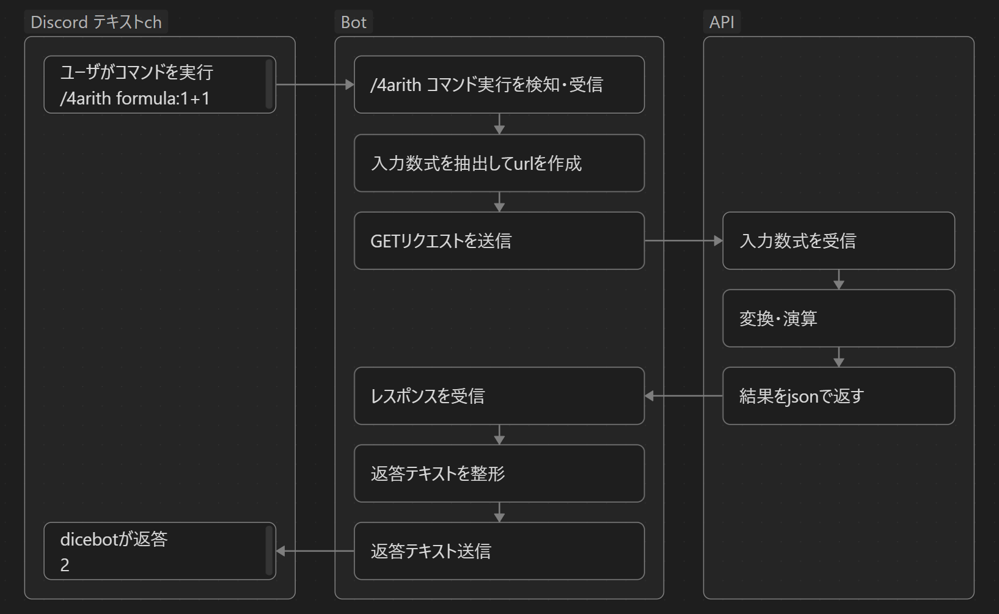

# dicebot - Discord Bot

## 【dicebotとは】
→ discordテキストチャンネルで簡単にサイコロを投げる機能を持つBot（四則演算機能も追加）

## 【コマンドの使い方】
1. メッセージ入力欄に半角スラッシュ「/」を入力（コマンド入力モードに入る）
2. 引数が必要なコマンドならば、表示される欄に値を入力する
3. 送信

### __/dice コマンド__
```
→ サイコロを振る

引数
- roll: サイコロを何回投げるか  ← 1 ~ 10    までの整数
- max : サイコロの面数　　　　  ← 1 ~ 10000 までの整数
```
### __/4arith コマンド__
```
→ 四則演算を行う

引数
- formula   : 解きたい数式  ←全て半角にしてください
- hide      : (任意) Trueで結果を自分だけに表示する
- showdetail: (任意) Trueでより詳細な結果を表示する

仕様
- 小数点を含む計算処理に失敗することがあります
- 使える演算子が少し特殊なので注意
    - 足し算: +
    - 引き算: -
    - 掛け算: * または x  ←小文字のエックス
    - 割り算: /

詳細表示の項目について
- input: 入力数式
- word : 入力数式を，数式として意味がある最小単位に分離したもの
- wordx: ()記号の仕様で掛け算記号が省略されている箇所にxを挿入したもの
- RPN  : 電卓によるアルゴリズム計算のために求めた「逆ポーランド記法(Reverse Poland Notation)」

「計算失敗」エラーのエラー文について
例）エラー文: [3] bracket is not open
- []で囲われた数値は，入力数式の 何番目 の文字が不正かを示しています
```
### /mydata コマンド
```
→ 実行者のDicebot使用データを表示する
- データ集計に同意したユーザの，スラッシュコマンドの実行・結果をcsvファイルに記録している
- 特に/diceで「1d100」を行った際の クリティカル・ファンブル を記録しておき，発生率や成功/失敗レート等を算出する

引数
- hide       :（任意）Trueで結果を自分だけに表示する

出力の項目について
- /dice   : スラッシュコマンド /dice を実行した総回数 
- 1d100   : max=100 として実行した総回数（roll=5，つまり「5d100」とした場合は5回分カウントされます）
- Critical: クリティカル総発生回数と，発生率（max=100 として実行したときの）
- Fumble  : ファンブル総発生回数と，発生率（max=100 として実行したときの）
- S/F Rate: 運の良さ（0 ~ 1で1に近いほど強運，Success/Failureの頭文字．max-100 として実行したときの）

出力例
================
/dice    : 4 回
----------------
1d100    : 13 回
Critical : 1 回 (7.692%)
Fumble   : 2 回 (15.385%)
S/F Rate : 0.625
================
Data period : 2025/11/23 ~ 2025/11/23


※このコマンドはデータ集計に同意したユーザしか使えません．
```

## 【Botの常時稼働】
- 自宅のミニPC(OS: Linux)に .py ファイルと，DiscordBotのトークンや，Discordのチャンネル，ユーザIDを記述した .env ファイルを配置
- xxx.service ファイルを作成して Active 状態になるように設定する
## 【ディレクトリ構造】
現時点(251123)
```
[root]
|- [data]
|    |- permission.txt
|    |- exec_log.csv
|    |- slcm_dice.csv
|    \- slcm_4arith.csv
|- .env
\- dicebot.py
```

## 【四則演算 /4arith】
- 24年夏に作成した「後置記法表示機能を持つ電卓アプリ」の内部処理を，25年2月にレンタルサーバ上にphp言語で書き換えてAPI化したものを利用．
	- （小数点周りのバリデーション処理が面倒だったので，半角ピリオドを多用すると正しく計算できない場合があります．）
- 次のエンドポイントに対してgetパラメータで数式を与えると，結果がjsonで返ってくる仕組みになっているので，Botにその操作を行わせる．
	- https://floor02.sakura.ne.jp/function/calculate/input.php
	- パラメータキー：formula
	- サンプル：(1+2)(-10+7)-3/4
		- https://floor02.sakura.ne.jp/function/calculate/input.php?formula=(1+2)(-10+7)-3/4
- 処理の流れイメージ
	- 
- 返ってくるjsonの例↓

計算成功時
```
{
  "status": "success",
  "error": null, ←エラーメッセージ
  "formula": "1+1",
  "word": "1 + 1",
  "wordx": "1 + 1",
  "reverse": "1 1 +",
  "solution": 2
}
```
計算失敗時
```
{
  "status": "error",
  "error": "the end is illegal character",
  "formula": "1+",
  "word": null,
  "wordx": null,
  "reverse": null,
  "solution": null
}
```

## 【ファイルの説明と保存データ】
### permission.txt
→データ集計に同意したユーザのIDを改行で羅列しただけのファイル
```
473663926538600448
123456789123456789
098765432198765432
```

### exec_log.csv
→スラッシュコマンドの実行記録
```
user_id,user_name,slcm_name,exec_time
473663926538600448,kah221,dice,2025-11-23 05:20:54.631580
473663926538600448,kah221,dice,2025-11-23 05:21:00.633012
473663926538600448,kah221,4arith,2025-11-23 05:21:43.565026
```
- user_id：ユーザID
- user_name：ユーザニックネーム（バリデーションで次を空文字に置き換え済み「"」「,」）
- slcm_name：実行したスラッシュコマンドの名前
- exec_time：実行時刻，datetime

### slcm_dice.csv
→スラッシュコマンド /dice に関する実行記録
```
user_id,exec_time,roll,max,result,judge
473663926538600448,2025-11-23 05:20:54.213085,1,6,6,0
473663926538600448,2025-11-23 05:21:00.297016,1,100,97,2
473663926538600448,2025-11-23 05:21:00.297016,1,100,2,1
```
- user_id：ユーザID
- exec_time：実行時刻，datetime
- roll：サイコロを何回振るか（rollを1より大きい値にしたとき，1回分に分割して記録することにしたため，常に1となる）
- max：サイコロの面数
- result：結果（rollの仕様上データ数は1つになる）
- judge：クリティカルorファンブル（1d100として実行された場合のみ有効）
	- 0：判定無し（maxが100ではないまたはmaxが100であってもクリティカルとファンブルのいずれでもない場合）
	- 1：クリティカル（1 ~ 5）
	- 2：ファンブル（96 ~ 100）

### slcm_4arith.csv
- スラッシュコマンド /4arith に関する実行記録
```
未定
```

## 【更新ログ】
- 240627_2348~  初着手，/dice 作成
- 251025_2104~  /4arith, /help-dicebot 追加
- 251118_0115~ /mydata 追加，データ蓄積開始(/dice)，演出追加